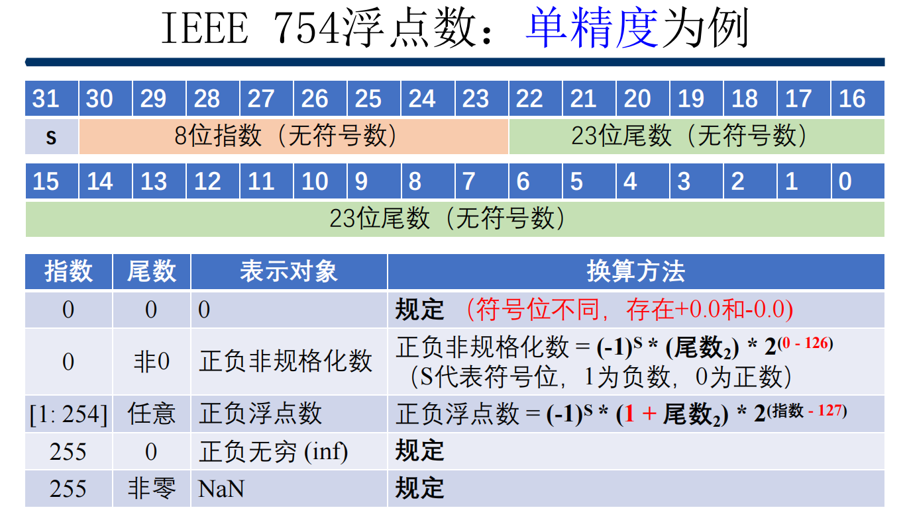

# CMU15-213
卡内基梅隆2021年春计算机系统实验(CSAPP)

终于开始写大名鼎鼎的csapp实验了。这10个实验我都会给出自己的实验思路

## datalab
datalab主要是让我们熟悉位运算和数据存储在计算机中的形式

### bitXor

使用 ~ 和 & 实现异或。通过德摩根律和异或的定义，我们可以得出以下推导：x ^ y = (~ x & y) | (x & ~ y) = ~ ~ ((~ x & y) | (x & ~ y)) = ~ (~ (~ x & y) & ~ (x & ~ y))。

### tmin

获取32位补码最小值。32位补码最小值是0x80000000，直接return 1 << 31 完事。

### isTmax

获取32位补码最大值。32位补码最大值x是0x7fffffff，直接我们可以看到，x+x+2值会溢出，溢出后值为0.但是-1也满足这个条件，所以只需x+x+2为0且x不为-1即可，判断是否为0不能使用==，这里
可以使用异或。

### allOddBits

判断奇数位是否全部为1。可以通过判断x&0xaaaaaaaa是否还为0xaaaaaaaa。这里我们需要先构造出0xaaaaaaaa，因为我们只能直接使用0-0xff。通过耗费四个运算符，我们可以做到这点：a = 
(0xAA << 8) | 0xAA， int b = (a << 16) | a。b就是0xaaaaaaaa。然后后面就很简单了。

### negate

返回负数，没话可说，每位取反，再加1.

### isAsciiDigit

判断是否满足0x30 <= x <= 0x39。我们分三个小部分：x >= 0x30，x < 0x39， x == 0x39。判断是否大于小于是这样：和相关数据的补码相加然后判断最高位是否为1。为1则是小于，不为1则是
大于等于。三个小部分分别可以这样判断：a = (x + ~0x2f) & j 为0， b = (x + ~0x38) & j不为0，c = !(x ^ 0x39)为1。其中j = 0x80 << 24。最后return !a&!!b|c。因为b = (x + 
~0x38) & j不为0只能得出x < 0x39而不能得出x == 0x39，故需要多出!(x ^ 0x39)为1来判断。其中为了节约运算符，我使用x + ~0x2f来替代x + ~0x30 + 1，因为我现在刚好是14个运算符嘻
嘻。

### isLessOrEqual

判断是否x<=y。由于溢出的存在，我们不能直接通过相加补码后右移31位判断是否为1来判断是否小于。溢出会使原来应该是小于等于的变成大于。如0x10000000和0x00000001和。本来应该是小于
的，结果会被判断为大于。这是我的核心思路：(x < 0 && y >= 0 || x - y > 0 || x == y) && !(x >= 0 && y < 0)
首先需要明确的是只有符号相异才会溢出。所以我们先判断若x >= 0 && y < 0，直接宣布大于。然后判断若x < 0 && y >= 0则不论后面结果如何，直接判断是小于，若这条不满足，后面结果是
不可能溢出的，则可以放心判断x - y > 0 或者 x == y。式子从左到右分别是abcd，可表示为a = !!(x >> 31) & !(y >> 31)，b = !!((x + (~y) + 1) >> 31)，c = !(x ^ y)，d = !(!(x >>
31) & !!(y >> 31))。返回(a | b | c) & d即可。注意千万是不能删除"!!"的，这个是将非0值转化为1的关键，如果没有这个，后面的|和&判断会出错！

### logicalNeg

使用~ & ^ | + << >>表示!。可以通过使用0的相反数符号位不变，是0。那么可以通过获取x和x相反数最高位来判断。有一点需要注意，这个数（以8位为例）10000000的相反数还是自己，但是符
号位也是相同。所以我们不能通过判断两个符号位异或是否为1，而是两个符号位或是否为1.

### howManyBits

太难了，我参考别人的哭泣😂。

### floatScale2

首先需要说明的是这个实验以及下面两个都需要熟悉iee754标准，如图：

在深入了解这个标准之后，后面的就简单了。首先如果是NaN或者是infinite，则直接返回，否则，如果是非规格化数，乘以2，否则将阶码加1。

### floatFloat2Int

将浮点数转化为int类型。首先对于大数，直接返回0x80000000u，什么是大数，int是32位，包含一位符号位，尾数最大为2-2的-23次方，故阶码大于31则视为大数，对于小数，即阶码小于0的
数，直接返回0。还有就是要注意的就是阶码大小和23的判断，因为不能使用float类型，所以如果先将尾数-1的那部分除以2的23次方，这会直接为0，所以首先将1拼到尾数-1 * 2的23次方那一部
分，再通过阶码和23的大小进行左移右移。

### floatPower2

通过阶码x（浮点数为2的x次方）返回浮点数。首先对阶码进行判断，是否过大过小，是否是规格化数，是否是非规格化数。最大是254-1-127=127，最小是2的-23次方乘以2的-126，即阶码为
149。超过127返回0xFF<<23，超过149返回0。否则x >= -126为规格化数，不然是非规格化数。规格化数只需要处理阶码，(x + 127) << 23。非规格化数处理尾数即可，1 << (149 + x)。

## bomblab

大名鼎鼎的拆炸弹实验。主要是考察x86汇编。还可以练习gdb的使用。主要思路及代码解析我放在的反汇编的文件上，写在注释里。这里主要记录收获。主要是x86汇编的总结和gdb的使用。

### x86架构

#### x86寄存器：

rax eax ax al   返回值
rbx ebx bx bl   被调用者保存
rcx ecx cx cl   第四个参数
rdx edx dx dl   第三个参数
rsi esi si sil  第二个参数
rdi edi di dil  第一个参数
rbp ebp bp bpl  被调用者保存
rsp esp sp spl  栈指针
r8  r8d r8w r8b 第五个参数
r9  r9d r9w r9b 第五个参数
r10 - r15       

#### x86常用指令：

##### 数据移动：

lea    0x01(%rax,%rsi,1),%ecx  ecx = rax + rsi * 1 + 0x01
mov    %edx,%eax               eax = edx

##### 指令跳转：

je     al等于bl跳转
jnb    al不等于bl跳转
jbe    al小于等于bl跳转
jge    al带符号大于等于bl跳转
jle    al带符号小于等于bl跳转

### gdb

GDB可以帮助你：

按你自己的要求随心所欲运行程序；让程序在你设置的断点处停下；当程序停下时，可以检查相关变量值、寄存器值、栈帧和函数调用栈结构；

gdb基本命令操作：

help 命令：查看命令讲解
print（p）：打印参数
run（r）：运行被调试的程序。如果此前没有下过断点，则执行完整个程序
continue（c）：继续执行被调试程序，直至下一个断点或程序结束
break（b）文件名:行号 / 函数名：打断点
break ... if ...：条件中断
backtrace（bt）：列出调用栈
step（s）：单步调试，跳入函数 si：汇编
next（n）：单步调试 ni：汇编

